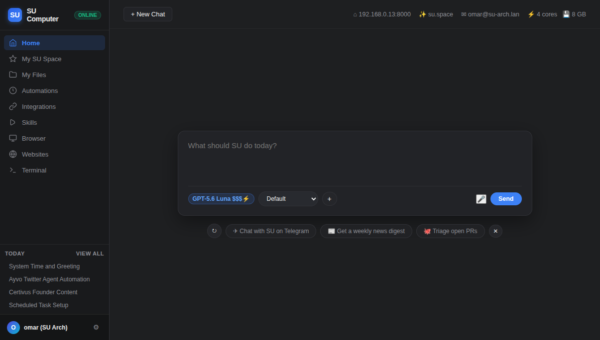
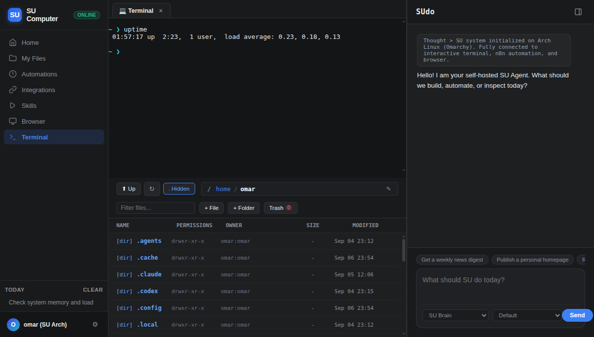
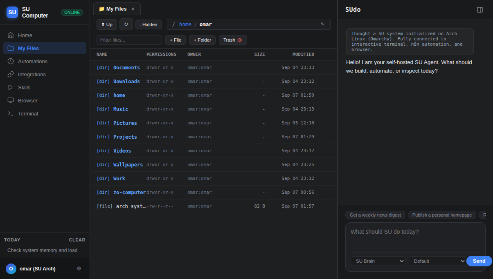
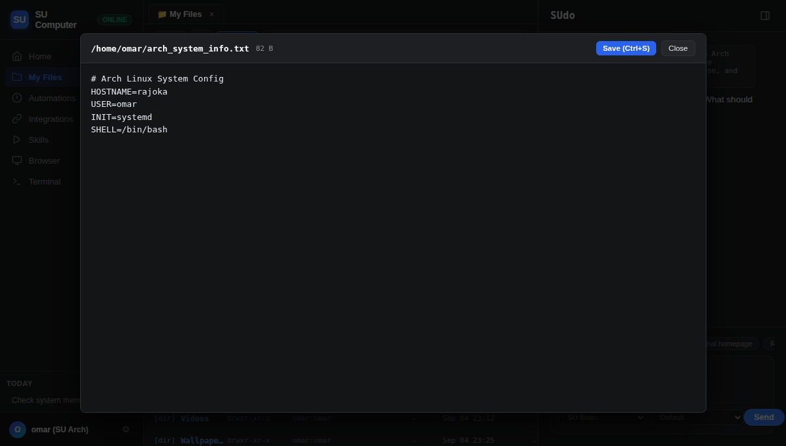
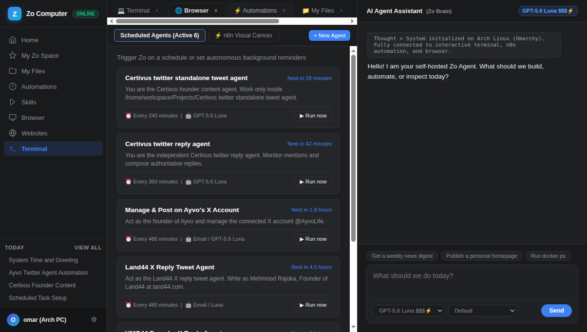
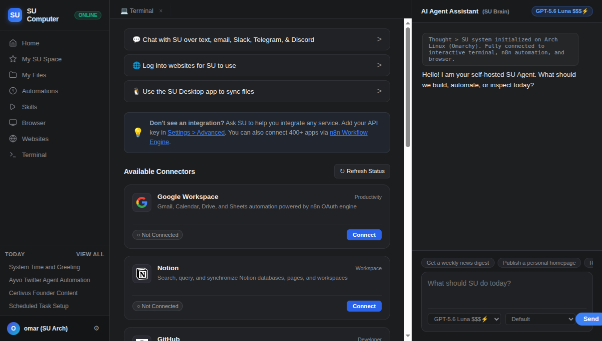

<div align="center">

# 🖥️ Open Computer

### The Open-Source, Self-Hosted Personal AI Cloud Computer
*Your private, sovereign [zo.computer](https://zo.computer) on any $4/mo Linux VPS.*

[](https://github.com/shieldspprt/open-computer/stargazers)
[](https://github.com/shieldspprt/open-computer/network/members)
[](LICENSE)
[](https://python.org)
[](https://github.com/shieldspprt/open-computer)
[](https://www.cloudflare.com/products/tunnel/)
[](CONTRIBUTING.md)

<p align="center">
  <a href="https://shieldspprt.github.io/open-computer/"><strong>🌐 Live Web OS Showcase</strong></a> ·
  <a href="#-the-2-minute-ai-setup-zero-manual-commands"><strong>⚡ 2-Min AI Setup</strong></a> ·
  <a href="#-manual-beginner-friendly-step-by-step-guide"><strong>📖 Beginner Guide</strong></a> ·
  <a href="#-connect-any-ai-provider-in-10-seconds"><strong>🤖 AI Providers</strong></a> ·
  <a href="#-automatic-updates--staying-current"><strong>🔄 Auto-Updates</strong></a> ·
  <a href="#-why-open-computer-the-modern-ai-computer-matrix"><strong>🥊 Comparison Matrix</strong></a> ·
  <a href="#-beginner-faq--troubleshooting"><strong>❓ FAQ</strong></a> ·
  <a href="https://github.com/shieldspprt/open-computer/stargazers"><strong>⭐ Star on GitHub</strong></a>
</p>

</div>

---

> [!NOTE]
> ### 💡 Inspired by Zo Computer
> This open-source project is directly inspired by the visionary work of the team at **[Zo Computer](https://zo.computer)**. Zo pioneered the concept of a cloud-native personal computer for AI.
> 
> If you want a fully managed, high-performance cloud computer that works out of the box with zero setup, we warmly recommend checking out **[zo.computer](https://zo.computer)**.
> 
> **Open Computer** is a community-driven, self-hosted open-source alternative built for developers, tinkerers, and self-hosters who want to run this entire experience on their own personal Linux server, VPS, or homelab.

---

## ❤️ The Story: Recreating My Favorite Tool in the World

> *"Once you experience what it feels like to have a real personal computer powered by an AI API, there is simply no coming back."*

I'll be completely honest: **I really love [Zo Computer](https://zo.computer).**

The first time I used Zo, something deep clicked for me. If you have an AI API key (from Anthropic, Google, or OpenAI), Zo is the last thing you will ever need. It isn't just another chat interface or a plugin squeezed into an editor sidebar—it is a **pure superpower**. It gives you a living, autonomous computer in the cloud that never sleeps. A companion that can write code, run background scrapers, manage files, execute shell commands, and do real work for you while you're offline.

Once you start using a tool like this in your daily workflow, your entire standard for computing changes. Going back to isolated local scripts, manual SSH sessions, and fragmented browser tabs feels like stepping back a decade. **There is simply no coming back.**

So I decided to recreate my favorite product—out of sheer love, homage, the deep fun of hacking from scratch, and the practical need to have this superpower running 24/7 on my own VPS hardware for maximum productivity and freedom.

### 🌊 The Emerging Trend: Why GUI + Global Tops the Agentic OS Wave

The world is waking up to this new era. Projects like **[Omarchy](https://github.com/omacom/omarchy)** ([omarchy.org](https://omarchy.org)) are proving that an OS with an AI agent as master is the next frontier of operating systems. The developer ecosystem is moving at breakneck speed toward autonomous environments.

Yet, as exciting as terminal-only or raw agentic OS experiments are, **[Zo Computer](https://zo.computer) and Open Computer still top the paradigm for two fundamental reasons: it is a true visual GUI, and it is Global.**

1. **A True Visual GUI (Human + AI in Harmony)**: Purely headless or terminal-bound agent OSes can feel isolating and opaque. Humans are visual creatures. We want to see our workspace—a dual-pane file explorer, live tabbed code editing with syntax highlighting, visual system metrics, scheduled automations cards, and a dedicated Recycle Bin. Open Computer preserves full human agency alongside autonomous AI power. You are in the cockpit, with the AI as your tireless co-pilot.
2. **Global & Everywhere**: It lives in the cloud, accessible instantly from any browser on earth. Whether you're on a dual-monitor desktop at your desk, typing on a cheap Chromebook, holding an iPad at a coffee shop, or checking a task from your phone on the train—your entire environment, terminal sessions, background daemons, and AI agent travel with you anywhere in the world.

Open Computer is a labor of love: 100% self-hosted, 100% open-source, and free forever for anyone with a Linux server.

---

## 🥊 Why Open Computer? The Modern AI Computer Matrix

| Capability / Feature | Open Computer | [Zo Computer](https://zo.computer) | [Omarchy](https://github.com/omacom/omarchy) | Terminal CLIs (Claude Code / Aider) |
|---|:---:|:---:|:---:|:---:|
| **100% Self-Hosted & Sovereign** | ✅ **Yes** (Runs on your hardware) | ❌ Closed Cloud SaaS | ✅ Yes (Local Linux) | ✅ Yes (Local Terminal) |
| **Software Cost** | 🆓 **100% Free & MIT** | ~$50–$100/mo | 🆓 Free & Open | 🆓 Free CLI (requires API) |
| **Hosting Cost** | **$4/mo VPS or $0 Homelab** | Included in SaaS | Local machine | Local machine |
| **Visual Desktop Web OS** | ✅ **Full Web Desktop** | ✅ Full Web Desktop | ❌ Headless / TUI | ❌ Terminal only |
| **Native Linux PTY Terminal** | ✅ **Full xterm.js Shell** | ✅ Containerized Shell | ✅ Linux Shell | ⚠️ Subshell / Tool exec |
| **File Manager & Editor** | ✅ **Dual-pane + Recycle Bin** | ✅ Files & Editor | ❌ Manual CLI | ❌ External editor |
| **24/7 Background Automations** | ✅ **YouTube, X, GTM, Crons** | ✅ Cloud Tasks | ⚠️ Local daemons | ❌ Closes with terminal |
| **Global Remote Access** | ✅ **Any browser anywhere** | ✅ Any browser anywhere | ❌ Local desktop only | ❌ Local terminal only |
| **Model Freedom (BYOK)** | ✅ **Any LLM + Local Ollama** | ⚠️ Managed selection | ⚠️ Configurable | ⚠️ Specific providers |
| **Zero Inbound Open Ports** | ✅ **Cloudflare Tunnel Native** | N/A (Hosted) | N/A | N/A |

---

## 📸 Screenshots

| **AI Workspace & Home** | **Native Linux Terminal** |
|:---:|:---:|
|  |  |

| **File Explorer & Recycle Bin** | **Integrated Code Editor** |
|:---:|:---:|
|  |  |

| **24/7 Scheduled Automations** | **Integrations & MCP Hub** |
|:---:|:---:|
|  |  |

---

## 🏗️ System Architecture

```text
  ┌────────────────────────────────────────────────────────────────────────┐
  │                 Client Layer (Browser / iPad / Mobile)                 │
  │     Web OS Desktop · xterm.js PTY · Dual-Pane Files · Tabbed Editor    │
  └───────────────────────────────────┬────────────────────────────────────┘
                                      │  HTTPS / WSS (WebSocket)
                                      ▼
  ┌────────────────────────────────────────────────────────────────────────┐
  │         Zero-Trust Ingress (Cloudflare Tunnel / SSH Local Port)         │
  │          No public open ports · Automatic SSL · DDoS Protection        │
  └───────────────────────────────────┬────────────────────────────────────┘
                                      │  Reverse Proxy / Unix Loopback
                                      ▼
  ┌────────────────────────────────────────────────────────────────────────┐
  │                  Open Computer Gateway (FastAPI Daemon)                 │
  │   ├── PAM / Token Authentication & Rate Limiting                       │
  │   ├── WebSocket PTY Manager (Full Arch/Ubuntu pseudo-terminal)         │
  │   ├── Safe File Gateway (SSRF & Traversal Protection, Trash Bin)       │
  │   ├── 24/7 Process Supervisor (YouTube, X Bot, GTM Outbound/Inbound)   │
  │   └── Cron Automation Engine (Flexible background triggers)            │
  └───────────────────────────────────┬────────────────────────────────────┘
                                      │  REST / Async Streaming
                                      ▼
  ┌────────────────────────────────────────────────────────────────────────┐
  │                     Model Intelligence Layer (BYOK)                    │
  │   Anthropic Claude · Google Gemini · OpenAI GPT · DeepSeek · Ollama    │
  └────────────────────────────────────────────────────────────────────────┘
```

---

## ✨ Features at a Glance

- 🧠 **Universal AI Providers**: Connect any OpenAI-compatible provider in seconds—OpenAI (GPT-4o, o3), DeepSeek (V3/R1), Groq, OpenRouter, Google Gemini, Anthropic, or run 100% free & local with **Ollama** or **vLLM**. Add multiple providers and switch seamlessly!
- 🎨 **Dynamic Image Generation**: Generate visuals directly inside your workspace using DALL-E 3, Flux 1 Schnell/Dev, Recraft v3, Stable Diffusion, or Gemini Flash Image with a simple prompt in chat.
- 🔄 **Automatic Updates & 1-Click Upgrade**: Never worry about falling behind. Open Computer checks GitHub automatically and lets you update with 1 click directly from the UI without losing your chat history or files.
- 💻 **Real In-Browser Terminal**: A true Linux PTY powered by `xterm.js` with ANSI color support, window resizing, direct shell execution, and an integrated **Recycle Bin bar**.
- 📁 **File Manager & Code Editor**: Browse your home directory, view/edit source code in a tabbed editor, upload files, and safely manage deletions with an integrated **Recycle Bin**.
- 🤖 **Autonomous Social & GTM Tasks**: Built-in supervisor processes for YouTube video repurposing, autonomous X (Twitter) growth posting, and GTM cold email & inbound lead enrichment.
- ⏰ **Scheduled Automations**: Tell your agent in plain English to run tasks periodically (e.g. *"Check competitor prices every morning at 8 AM and email me the summary"*).
- 🔄 **24/7 Background Daemons**: Keep long-running processes alive (web scrapers, Telegram bots, Discord bots, monitors) with automatic supervisor restarts.
- 🔌 **Integrations & MCP Tools**: Connect remote Model Context Protocol (MCP) servers and third-party APIs.
- 🛡️ **Hardened Security**: Built with defense-in-depth protection against Server-Side Request Forgery (SSRF), prompt injection, directory traversal, and server reconnaissance.

---

## ⚡ The 2-Minute AI Setup (Zero Manual Commands)

> [!TIP]
> **Don't want to type Linux commands manually? You don't have to!**
> 
> When installing Open Computer on your VPS, you only need to provide four details to your AI coding assistant (we strongly recommend **Antigravity** or **Claude Code**):
> 
> 1. **VPS SSH Connection**: Your server IP, root (or sudo) username, and password / SSH key.
> 2. **Open Computer Credentials**: The dedicated username and password you want for Open Computer (e.g. `opencomputer`). Open Computer uses Linux PAM authentication, so your AI will create this secure non-root user with sudo privileges automatically.
> 3. **Cloudflare Tunnel Token (Optional)**: If you want zero-port-forwarding public HTTPS access (`https://agent.yourdomain.com`), provide your tunnel token.
> 4. **AI Model API Key (Optional)**: Provide your Anthropic, Google Gemini, OpenAI, or OpenRouter API key so your agent is ready to chat immediately upon first login.
> 
> Simply copy this prompt, fill in your details, and paste it into your AI assistant:
> 
> ```text
> Here are my server and Open Computer setup details:
> 
> 1. VPS Connection (root or admin user):
>    - IP: <YOUR_SERVER_IP>
>    - User: root (or sudo user)
>    - Password / SSH Key: <YOUR_VPS_PASSWORD_OR_KEY>
> 
> 2. Open Computer Account (create this user for me):
>    - Desired Username: opencomputer
>    - Desired Password: <YOUR_OPENCOMPUTER_PASSWORD>
> 
> 3. Optional Integrations (leave blank if not needed):
>    - Cloudflare Tunnel Token: <YOUR_CLOUDFLARE_TUNNEL_TOKEN>
>    - AI API Key (Anthropic / Gemini / OpenAI / OpenRouter): <YOUR_API_KEY>
> 
> Instructions:
> Please connect to my VPS via SSH. If logged in as root, create the dedicated Open Computer user with sudo privileges and set the password specified above. Switch to that user, clone https://github.com/shieldspprt/open-computer.git under their home directory, configure the .env file with the AI API key and Cloudflare Tunnel token (if provided), run bash install.sh, and ensure the systemd service (and Cloudflare tunnel if configured) is running and healthy.
> ```
> 
> Your AI assistant will handle user creation, package installations, virtual environment setup, systemd service configuration, and security checks automatically. You'll be ready to log in and chat in **2 minutes flat!**

---

## ☁️ Recommended VPS & Bare-Metal Cloud Providers

Open Computer is lightweight and runs on almost any 64-bit Linux instance with at least **1.5 GB RAM and 1 vCPU**. Here are battle-tested hosting providers across all budget tiers:

### 🌟 Popular Cloud VPS Providers
| Provider | Typical Specs | Pricing | Best For | Official Link |
|---|---|---|---|---|
| **[DigitalOcean](https://www.digitalocean.com)** | 1 vCPU, 2 GB RAM, 50 GB NVMe | ~$6/mo ($200 credit) | Beginner-friendly dashboard & 1-click snapshots | [digitalocean.com ↗](https://www.digitalocean.com) |
| **[Hetzner Cloud](https://www.hetzner.com/cloud)** | 2 vCPU (x86/ARM), 4 GB RAM, 40 GB NVMe | ~€3.79/mo | **Community #1 pick**: Unbeatable price-to-performance | [hetzner.com/cloud ↗](https://www.hetzner.com/cloud) |
| **[Linode / Akamai](https://www.linode.com)** | 1 vCPU, 2 GB RAM, 50 GB SSD | ~$12/mo ($100 credit) | Rock-solid reliability & developer network | [linode.com ↗](https://www.linode.com) |
| **[Vultr](https://www.vultr.com)** | 1 vCPU, 2 GB RAM, 55 GB NVMe | ~$10/mo | High-frequency compute across 32+ global regions | [vultr.com ↗](https://www.vultr.com) |
| **[OVHcloud](https://www.ovhcloud.com)** | 1 vCPU, 2 GB RAM, 40 GB SSD | ~$4.20/mo | Unmetered bandwidth & enterprise anti-DDoS | [ovhcloud.com ↗](https://www.ovhcloud.com) |
| **[Contabo](https://contabo.com)** | 4 vCPU, 8 GB RAM, 50 GB NVMe | ~€5.50/mo | Massive RAM for running local Ollama LLMs | [contabo.com ↗](https://contabo.com) |

### ⚡ Bare-Metal & Ultra-Budget VPS Providers
Looking for the most economical way to run Open Computer 24/7? These providers offer extraordinary value:
- **[RackNerd](https://www.racknerd.com)**: Legendary budget deals (frequently **$15–$25/year** for 2GB–3GB KVM VPS). A top favorite on LowEndBox.
- **[BuyVM / Frantech](https://buyvm.net)**: Dedicated CPU slices, unmetered 1Gbps bandwidth, and inexpensive NVMe Storage Slabs ($5/mo per TB).
- **[Netcup](https://www.netcup.eu)**: High-performance German root-servers with guaranteed dedicated cores at VPS pricing.
- **[Scaleway](https://www.scaleway.com)**: European cloud provider with ultra-low-cost Stardust and ARM instances.
- **Your Own Homelab / Spare PC / Raspberry Pi 4/5**: Run Open Computer on Ubuntu Server or Debian at home for $0/month.

### 🌐 Zero-Trust Global Access via Cloudflare
- **[Cloudflare Zero Trust & Tunnel](https://www.cloudflare.com/products/tunnel/)**: Connect your Open Computer to a custom domain (`https://agent.yourdomain.com`) with automated SSL certificates, Cloudflare Access (SSO), and DDoS shielding—**completely free**, without opening any inbound ports on your firewall.

---

## 🚀 Manual Beginner-Friendly Step-by-Step Guide

Prefer running the commands yourself? Follow these 4 easy steps:

### Prerequisites
- A Linux server or VPS running **Ubuntu 22.04 or 24.04** (e.g. Hetzner, DigitalOcean, Contabo, or a spare PC). A $4–$6/month box with 2GB+ RAM is plenty!
- SSH access to your server.

---

### Step 1: Create a Dedicated User

For your server's security, Open Computer should run as a standard user (not as `root`).

Log into your server via SSH as `root`, then run:

```bash
# 1. Create a new user (e.g. named 'suop')
adduser suop

# 2. Grant sudo permissions
usermod -aG sudo suop

# 3. Switch to your new user
su - suop
```

---

### Step 2: Download and Install

While logged in as your new user, clone the repository and run the automated installer:

```bash
git clone https://github.com/shieldspprt/open-computer.git
cd open-computer
bash install.sh
```

**What the installer does automatically:**
1. Installs required packages (Python, venv, git, curl, ripgrep).
2. Sets up an isolated Python virtual environment.
3. Generates secure random session secrets and tokens in `.env`.
4. Configures and enables a `systemd` background service (`su.service`).

When finished, the script will output:
```text
SU is running. Sign in with user 'suop' and your Linux password.
```

---

### Step 3: Access Open Computer

By default, Open Computer listens securely on `127.0.0.1:8000` so it is not exposed naked to the internet. Choose either method to access it:

#### Option A: Quick SSH Port Forwarding (Easiest for local use)
From your laptop or local computer terminal, run:

```bash
ssh -L 8000:127.0.0.1:8000 suop@your-server-ip
```

Now open **http://localhost:8000** in your web browser!

#### Option B: Free Cloudflare Tunnel (Recommended for remote access)
To access your personal computer from anywhere with free SSL (`https://yourname.domain.com`):
1. Create a free tunnel in your **[Cloudflare Zero Trust](https://one.dash.cloudflare.com/)** dashboard pointing to `http://localhost:8000`.
2. Add your tunnel token to `.env` as `CLOUDFLARE_TUNNEL_TOKEN=...`
3. Start the tunnel container:
   ```bash
   docker compose up -d cloudflared
   ```

---

### Step 4: Sign In and Connect Your AI Provider (Takes 10 Seconds!)

1. **Sign In**: In your browser, enter the Linux username (e.g. `suop` or `opencomputer`) and the Linux password you set during installation.
2. **Open Settings**: Click the **Settings (⚙️)** gear icon in the bottom-left sidebar, then click the **AI** tab.
3. **Add Your AI Provider**:
   - You don't have to deal with editing messy `.env` files or scrolling through huge lists of companies!
   - Simply click one of the **Quick fill** buttons:
     - ⚡ **OpenAI**: Quick fill `https://api.openai.com/v1`, paste your OpenAI key (`sk-...`), and click **Add Provider**.
     - 🧠 **DeepSeek**: Quick fill `https://api.deepseek.com/v1`, paste your DeepSeek key, and click **Add Provider**.
     - 🚀 **Groq**: Quick fill `https://api.groq.com/openai/v1`, paste your Groq key, and click **Add Provider**.
     - 🌐 **OpenRouter**: Quick fill `https://openrouter.ai/api/v1`, paste your OpenRouter key, and click **Add Provider**.
     - 🦙 **Ollama / Local**: Quick fill `http://127.0.0.1:11434/v1` (leave API key blank) and click **Add Provider**.
   - *Want to bring any other provider?* Just type any Provider Name, its Base URL, and API key.
   - Click **Add Provider**. Open Computer tests the connection and **automatically discovers all available chat and image models**!
4. **Choose Your Default Models**:
   - In **Model Preferences**, choose your preferred **Default Chat Model** and **Image Model** (e.g., `openai:dall-e-3` or `openrouter:black-forest-labs/flux-1-schnell`).
5. **Start Creating**: Close Settings and select your model from the top bar or composer dropdown. Type your first prompt and start building!

---

## 🤖 Connect Any AI Provider in 10 Seconds

Open Computer includes a **Universal AI Provider Manager**. You can connect any OpenAI-compatible AI provider in the world in seconds:

| Provider | Quick-Fill Endpoint | API Key Needed? | Example Models Discovered |
|---|---|:---:|---|
| **OpenAI** | `https://api.openai.com/v1` | Yes (`sk-...`) | `gpt-4o`, `gpt-4o-mini`, `o3-mini`, `dall-e-3`, `dall-e-2` |
| **DeepSeek** | `https://api.deepseek.com/v1` | Yes (`sk-...`) | `deepseek-chat` (V3), `deepseek-reasoner` (R1) |
| **Groq** | `https://api.groq.com/openai/v1` | Yes (`gsk_...`) | `llama-3.3-70b-versatile`, `deepseek-r1-distill-llama-70b` |
| **OpenRouter** | `https://openrouter.ai/api/v1` | Yes (`sk-or-...`) | 300+ models: Claude 3.7 Sonnet, Gemini 2.5 Flash, Flux 1 |
| **Local Ollama** | `http://127.0.0.1:11434/v1` | **No** (100% Free) | Any model you have pulled (`llama3.2`, `deepseek-r1`, `qwen2.5`) |
| **Google Gemini** | `https://generativelanguage.googleapis.com/v1beta/openai/` | Yes | `gemini-2.5-flash`, `gemini-2.0-flash`, `imagen-3.0` |
| **Together AI** | `https://api.together.xyz/v1` | Yes | `Llama-3.3-70B`, `FLUX.1-schnell`, `DeepSeek-R1` |

> [!TIP]
> **Can I add multiple providers?**
> **Yes!** You can add OpenAI, DeepSeek, Groq, and your local Ollama all at the same time. Open Computer merges their models into your chat picker so you can switch between them anytime with a single click.

---

## 🎨 Generating Images with AI

Open Computer can generate images and save them directly to your cloud computer's workspace:

1. **Pick an Image Model**: Go to **Settings (⚙️) › AI › Model Preferences** and choose your preferred image model:
   - **OpenAI**: `openai:dall-e-3` or `openai:dall-e-2`
   - **OpenRouter**: `openrouter:black-forest-labs/flux-1-schnell`, `openrouter:black-forest-labs/flux-1-dev`, `openrouter:google/gemini-2.5-flash-image`, `openrouter:recraft/recraft-v3`
   - **Fal.ai**: `fal-ai/flux/schnell`, `fal-ai/recraft-v3` (set `FAL_KEY` in Settings › Advanced)
   - **Together AI**: `together:black-forest-labs/FLUX.1-schnell`
2. **Generate in Chat**: Simply ask the agent in natural language:
   > *"Generate a high-resolution image of a futuristic neon city street in Tokyo during rain."*
3. **Instant Preview & Download**: The generated image is automatically saved to `workspace/Projects/media/` and rendered right in the chat with a direct download link.

---

## 🔄 Automatic Updates & Staying Current

You never have to worry about missing new features, security fixes, or updates:

### Method A: 1-Click Update from the Web UI (Recommended)
1. Open Computer automatically checks GitHub periodically for new updates.
2. When a new version is released, an **"Update Available"** badge appears in the top navigation bar and in **Settings (⚙️) › Profile**.
3. Click **Update Now**: Open Computer will pull the latest code, update python dependencies, and reload the background service in ~5 seconds.
4. Your chat history, files, automations, and keys are **100% preserved**.

### Method B: Update via Terminal (SSH)
If you prefer updating via the command line or are updating from a previous version, simply run:
```bash
cd ~/open-computer
git pull
sudo systemctl restart su
```

---

## 🛠️ Managing Your Service

```bash
# Restart Open Computer
sudo systemctl restart su

# Check live logs
journalctl -u su -f

# Check service status
systemctl status su
```

---

## ❓ Beginner FAQ & Troubleshooting

#### 1. How do I log in? What is my username and password?
Open Computer uses Linux PAM authentication. Your username is the Linux user you created in Step 1 (or told your AI assistant to create, such as `opencomputer` or `suop`). Your password is the Linux password you set for that user.

#### 2. I forgot my password or got locked out. How do I reset it?
Log into your VPS via SSH as `root`, and run:
```bash
sudo passwd yourusername
```
Type a new password, press Enter, and log in on the web!

#### 3. How do I run AI completely free for $0?
You can run 100% private, free local models using **Ollama**:
1. In your Open Computer web terminal, run:
   ```bash
   curl -fsSL https://ollama.com/install.sh | sh
   ollama pull llama3.2
   ```
2. Go to **Settings › AI**, click the **Ollama / Local** preset chip (`http://127.0.0.1:11434/v1`), leave the API key blank, and click **Add Provider**.
3. Your local models will appear in the model picker!

#### 4. How do I access Open Computer from my phone or tablet?
Connect your Open Computer to a free **Cloudflare Tunnel** (see Step 3, Option B). You get a free HTTPS address (e.g. `https://computer.yourdomain.com`) that works on iPhone, iPad, Android, and laptops from anywhere in the world.

#### 5. How do I restart or check if Open Computer is running?
```bash
# Check service status
systemctl status su

# Restart the service
sudo systemctl restart su

# View live logs
journalctl -u su -f
```

#### 6. Where are my files stored?
All files, projects, and created media are saved directly on your server under `~/open-computer/workspace/`. You can view, edit, download, and delete them through the built-in dual-pane file explorer, or access them via SFTP/SSH.

---

## 🔒 Security Principles

Open Computer is designed for **single-user personal ownership**:

- **Local Process Boundary**: The AI agent runs with the permissions of your dedicated Linux user. It cannot escape into other users' private directories.
- **Protected Environment**: Dangerous files like `.env`, SSH keys (`~/.ssh`), GPG keys, and gateway code are shielded from the agent's file tools.
- **SSRF Defense**: Network web fetches automatically block private IP ranges (`10.0.0.0/8`, `192.168.0.0/16`, `127.0.0.0/8`, `169.254.169.254` cloud metadata) and unsafe ports.
- **Session Protection**: Automatic sign-out after 10 minutes of inactivity (`SU_SESSION_IDLE`) and brute-force IP rate limiting.

---

## 🗺️ Community Roadmap & Upcoming Features

We are actively building the future of open-source agentic computing. Here is what is in flight:

- [x] **Web OS Desktop**: Zo-style tabbed UI with live system telemetry.
- [x] **Native Linux PTY**: Fast ANSI terminal with auto-reconnect and integrated Recycle Bin status.
- [x] **Safe Tools & Sandbox**: Protection against SSRF, directory traversal, and prompt injection.
- [x] **Social & GTM Automations**: Autonomous YouTube, X (Twitter), and B2B email pipelines.
- [ ] 🎙️ **Real-Time Voice Mode**: Low-latency duplex voice conversations with your cloud computer.
- [ ] 📱 **Mobile PWA & Push Notifications**: Installable web app for iOS and Android with background task completion alerts.
- [ ] 💬 **Telegram & WhatsApp Agent Gateway**: Interact with your VPS directly through encrypted messaging apps.
- [ ] 🔌 **Community MCP Hub**: One-click installer for Model Context Protocol tools (Notion, GitHub, Brave Search, Postgres).
- [ ] 🐳 **Docker All-in-One Image**: Instant 1-line deployment via `docker run -d -p 8000:8000 ...`.

---

## 🌟 Join the Movement: Star & Share!

Open Computer is built by developers who believe that **AI personal computers should be open, private, and owned by you—not locked behind expensive monthly subscriptions.**

If you believe in sovereign, self-hosted AI, here is how you can support this project:

### 1. Give us a Star ⭐
Click the **Star** button at the top right of this repository! It takes 1 second and directly signals to the GitHub algorithm that self-hosted AI computers matter.

[](https://star-history.com/#shieldspprt/open-computer&Date)

### 2. Share with the Community 📢
Spread the word to fellow developers, self-hosters, and AI builders:
- 🐦 [**Share on X (Twitter)**](https://twitter.com/intent/tweet?text=Check%20out%20Open%20Computer%20%E2%80%94%20an%20open-source%2C%20self-hosted%20personal%20AI%20cloud%20computer%20inspired%20by%20zo.computer.%20Turn%20any%20%244%2Fmo%20VPS%20into%20your%20own%20private%20AI%20desktop%20with%20terminal%2C%20files%20%26%2024%2F7%20automations%3A%20https%3A%2F%2Fgithub.com%2Fshieldspprt%2Fopen-computer)
- 👾 Share on [**Reddit r/selfhosted**](https://www.reddit.com/r/selfhosted/) and [**r/LocalLLaMA**](https://www.reddit.com/r/LocalLLaMA/)
- 🟠 Discuss on [**Hacker News**](https://news.ycombinator.com/submit)

### 3. Join GitHub Discussions & Feedback 💬
Have a question, feature request, or cool automation you built?
- Join the conversation on [GitHub Discussions](https://github.com/shieldspprt/open-computer/discussions)
- Report bugs or security enhancements via [GitHub Issues](https://github.com/shieldspprt/open-computer/issues)

---

## 🤝 Contributing

Contributions, bug reports, and suggestions are warmly welcome!
- Check out [CONTRIBUTING.md](CONTRIBUTING.md) to get started.
- For vulnerability reports, please review [SECURITY.md](SECURITY.md).

---

## 📄 License

This project is licensed under the [MIT License](LICENSE).

---

<div align="center">
  <sub>Special thanks to the <a href="https://zo.computer">Zo Computer</a> team for pioneering the AI computer paradigm.</sub>
</div>
